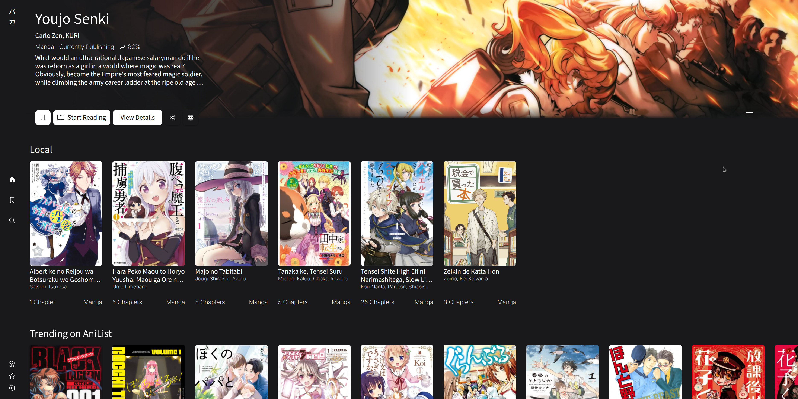
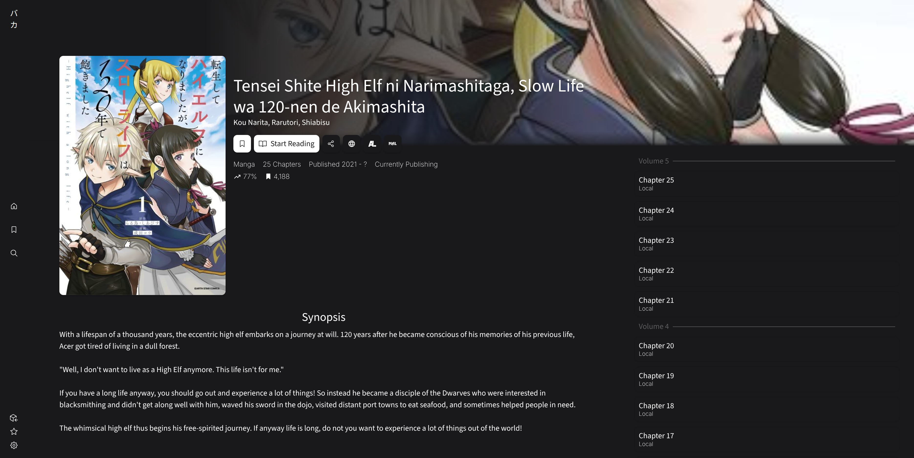
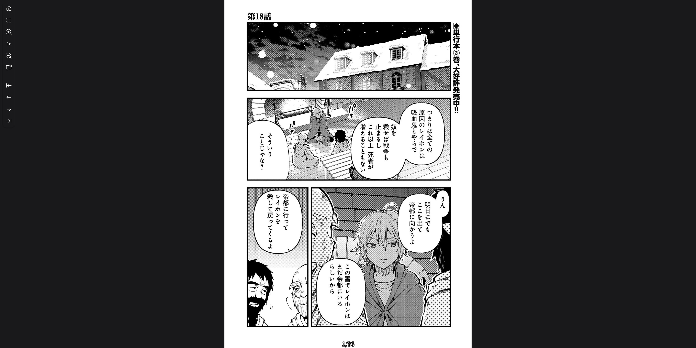
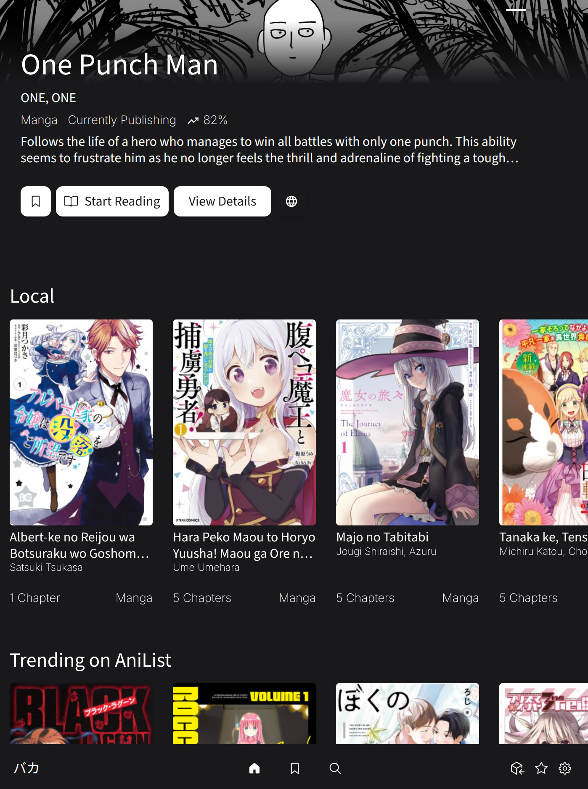
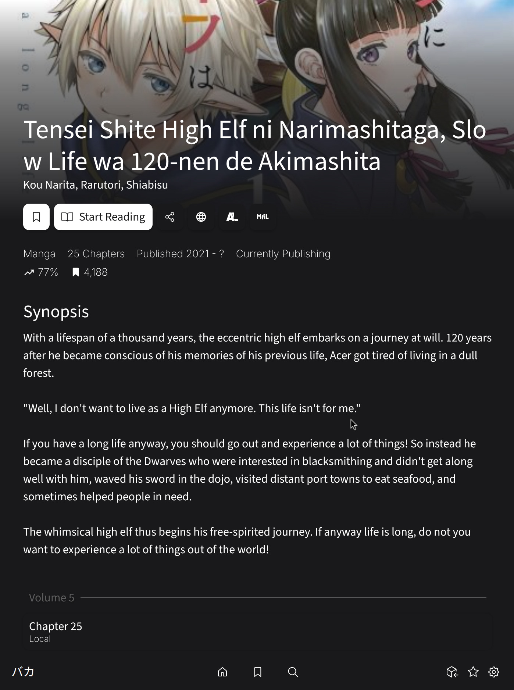
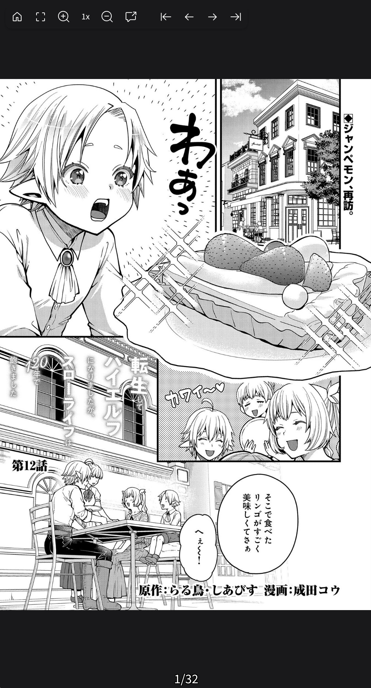

# bakayomi
A multi-platform Comic reader with built-in OCR capabilities, aimed at new and long-term language learners.

## Development
_Uses Deno (able to substitute with any runtime), Vite, and Tauri._

Install packages
`npm install`

### Development Server
Start development server by running `deno task dev`
Start Tauri development server by running `deno task tauri dev`

### Building
Web: `deno task build`
Tauri: `denot task tauri build`

# Gallery

